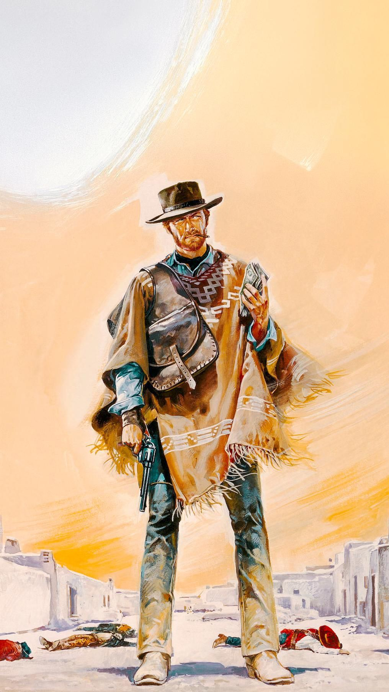
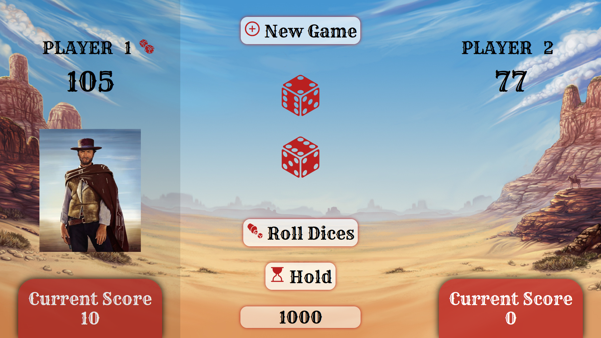
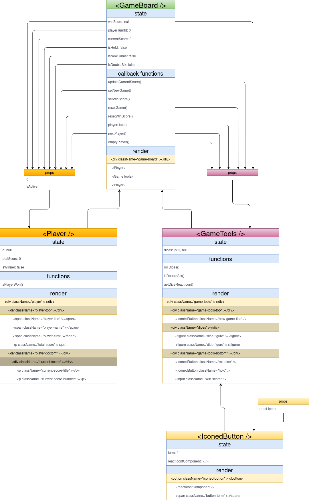

#  Dices Game

A competitive dice game between two players where the goal is to reach a sum of dice results which will be higher than the required score initialized at the beginning of the game.

## :technologist: Languages

- React
- JavaScript
- CSS
- HTML

## :package: Dependencies

- howler: 2.2.3
- node-sass: 7.0.0
- react-icons: 4.3.1

## :alembic: Preparation Diagram

## :beers: Recognition 

A great thanks to Appleseeds Bootcamp!